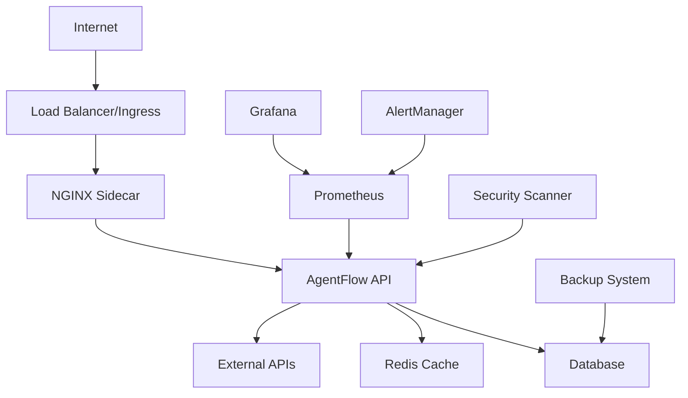

# AgentFlow API Deployment Guide

This directory contains comprehensive deployment configurations and automation scripts for the AgentFlow API. The deployment setup supports multiple environments with production-ready features including high availability, security, monitoring, and disaster recovery.

## 📁 Directory Structure

```
deployment/
├── kubernetes/          # Raw Kubernetes manifests
├── helm/               # Helm charts for easy deployment
├── scripts/            # Deployment and management scripts
├── cicd/              # CI/CD pipeline configurations
├── monitoring/        # Monitoring and alerting setup
├── security/          # Security policies and scanning
└── README.md          # This file
```

## 🚀 Quick Start

### Prerequisites

- Kubernetes cluster (v1.19+)
- Helm 3.12+
- kubectl configured to access your cluster
- Docker for building images

### 1. Deploy with Helm (Recommended)

```bash
# Add Helm repository (if published)
helm repo add agentflow https://charts.agentflow.ai

# Deploy to staging
helm install agentflow-api-staging ./deployment/helm/agentflow-api \
  --namespace agentflow-staging \
  --create-namespace \
  --values ./deployment/helm/agentflow-api/values-staging.yaml

# Deploy to production
helm install agentflow-api ./deployment/helm/agentflow-api \
  --namespace agentflow \
  --create-namespace \
  --values ./deployment/helm/agentflow-api/values-production.yaml
```

### 2. Deploy with Scripts

```bash
# Make scripts executable
chmod +x deployment/scripts/*.sh

# Deploy to staging
./deployment/scripts/deploy.sh staging deploy

# Deploy to production
./deployment/scripts/deploy.sh production deploy --image-tag v1.0.0
```

### 3. Deploy with Raw Kubernetes Manifests

```bash
# Create namespace and deploy all resources
kubectl apply -f deployment/kubernetes/namespace.yaml
kubectl apply -f deployment/kubernetes/
```

## 🏗️ Architecture Overview

### High-Level Components



### Key Features

- **High Availability**: Multi-replica deployment with pod anti-affinity
- **Auto Scaling**: Horizontal and Vertical Pod Autoscalers
- **Load Balancing**: NGINX ingress with SSL termination
- **Security**: Network policies, Pod Security Policies, security scanning
- **Monitoring**: Prometheus metrics, Grafana dashboards, alerting
- **Backup & Recovery**: Automated database backups with point-in-time recovery
- **CI/CD**: GitHub Actions and GitLab CI pipelines
- **Zero Downtime**: Rolling updates with readiness/liveness probes

## 🐳 Container Configuration

### Base Image
- **Base**: Node.js 20 Alpine
- **Security**: Non-root user, read-only filesystem
- **Size**: Optimized multi-stage build (~150MB)

### Sidecar Container
- **NGINX**: Reverse proxy and static file serving
- **Benefits**: SSL termination, rate limiting, caching

## 📊 Monitoring & Observability

### Metrics
- **Application Metrics**: Request rate, response time, error rate
- **System Metrics**: CPU, memory, disk, network
- **Business Metrics**: API usage, user activity, revenue impact

### Dashboards
- Pre-configured Grafana dashboard with key metrics
- Real-time performance monitoring
- SLA tracking (99.9% uptime target)

### Alerting
- **Critical**: API down, high error rate, database issues
- **Warning**: High latency, resource usage, scaling events
- **Info**: Deployments, configuration changes

## 🔒 Security

### Network Security
- **Network Policies**: Restrict pod-to-pod communication
- **Ingress Security**: Rate limiting, CORS, security headers
- **TLS**: End-to-end encryption with Let's Encrypt

### Container Security
- **Pod Security Policies**: No privileged containers
- **Security Context**: Non-root user, read-only filesystem
- **Image Scanning**: Trivy vulnerability scanning

### Access Control
- **RBAC**: Least privilege access for service accounts
- **Secrets Management**: Kubernetes secrets with encryption at rest
- **Audit Logging**: All API access logged and monitored

## 💾 Backup & Disaster Recovery

### Automated Backups
- **Schedule**: Daily at 2 AM UTC
- **Retention**: 30 days (configurable)
- **Storage**: AWS S3 with cross-region replication
- **Encryption**: AES-256 with KMS keys

### Recovery Procedures
- **RTO**: 15 minutes (Recovery Time Objective)
- **RPO**: 1 hour (Recovery Point Objective)
- **Testing**: Monthly disaster recovery drills

## 🔄 CI/CD Pipeline

### GitHub Actions Workflow
```yaml
Trigger: Push to main/develop, PR to main
├── Security Scan (Trivy, Snyk)
├── Test & Quality (Jest, ESLint, Coverage)
├── Build & Push (Multi-arch Docker image)
├── Deploy Staging (Auto on develop)
├── Deploy Production (Manual on main)
└── Cleanup (Remove old images)
```

### GitLab CI Pipeline
Similar workflow with GitLab-specific features and Docker registry.

## 📝 Environment Configuration

### Staging Environment
- **Purpose**: Integration testing, QA validation
- **Resources**: 2 replicas, 512Mi memory, 500m CPU
- **Features**: Debug logging, permissive network policies
- **URL**: https://api-staging.agentflow.ai

### Production Environment
- **Purpose**: Live user traffic
- **Resources**: 5+ replicas, 2Gi memory, 2000m CPU
- **Features**: Optimized performance, strict security
- **URL**: https://api.agentflow.ai

## 🛠️ Management Scripts

### Deployment Script
```bash
./deployment/scripts/deploy.sh [environment] [action] [options]

# Examples:
./deploy.sh staging deploy
./deploy.sh production deploy --image-tag v1.2.3
./deploy.sh staging rollback
./deploy.sh production status
./deploy.sh staging logs --follow
./deploy.sh production scale --replicas 10
```

### Database Migration Script
```bash
./deployment/scripts/database-migrate.sh [environment] [action] [options]

# Examples:
./database-migrate.sh staging migrate
./database-migrate.sh production status
./database-migrate.sh staging rollback --steps 2
./database-migrate.sh production backup
```

### Backup Script
```bash
./deployment/scripts/backup.sh [action] [environment] [options]

# Examples:
./backup.sh backup production
./backup.sh restore staging --backup-id 20231201-120000
./backup.sh list production
./backup.sh cleanup production --retention-days 7
```

## 🔧 Configuration Management

### Helm Values
- **values.yaml**: Default configuration
- **values-staging.yaml**: Staging overrides
- **values-production.yaml**: Production overrides

### Environment Variables
- Managed through Kubernetes ConfigMaps and Secrets
- Environment-specific configurations
- Secure secret management with base64 encoding

### Feature Flags
- Runtime configuration changes without deployment
- Gradual feature rollouts
- A/B testing capabilities

## 📈 Scaling Guidelines

### Horizontal Scaling
- **Staging**: 2-5 replicas
- **Production**: 5-50 replicas
- **Triggers**: CPU > 70%, Memory > 80%

### Vertical Scaling
- **VPA**: Automatic resource recommendations
- **Limits**: Up to 4 CPU cores, 8Gi memory
- **Monitoring**: Resource utilization tracking

### Database Scaling
- **Read Replicas**: For read-heavy workloads
- **Connection Pooling**: Optimize database connections
- **Caching**: Redis for frequently accessed data

## 🚨 Troubleshooting

### Common Issues

1. **Pod CrashLoopBackOff**
   ```bash
   kubectl describe pod -n agentflow -l app=agentflow-api
   kubectl logs -n agentflow -l app=agentflow-api --previous
   ```

2. **High Memory Usage**
   ```bash
   kubectl top pods -n agentflow
   # Check for memory leaks in application code
   ```

3. **Database Connection Issues**
   ```bash
   kubectl exec -it -n agentflow deployment/agentflow-api -- sh
   # Test database connectivity from pod
   ```

4. **SSL Certificate Problems**
   ```bash
   kubectl get certificates -n agentflow
   kubectl describe certificate agentflow-api-tls -n agentflow
   ```

### Health Checks
- **Liveness**: `/health` endpoint
- **Readiness**: `/health` endpoint with dependency checks
- **Startup**: Extended timeout for initial startup

### Debugging Tools
- **kubectl**: Pod inspection and log viewing
- **Grafana**: Performance metrics and dashboards
- **Prometheus**: Raw metrics and alerting
- **Jaeger**: Distributed tracing (if enabled)

## 📋 Maintenance

### Regular Tasks
- **Weekly**: Review metrics and alerts
- **Monthly**: Update dependencies and images
- **Quarterly**: Disaster recovery testing
- **Annually**: Security audit and penetration testing

### Update Procedures
1. Test in staging environment
2. Create database backup
3. Deploy with rolling update
4. Monitor metrics and logs
5. Rollback if issues detected

### Capacity Planning
- Monitor resource usage trends
- Plan for traffic growth
- Scale infrastructure proactively
- Optimize costs with right-sizing

## 🔗 Additional Resources

- [Kubernetes Documentation](https://kubernetes.io/docs/)
- [Helm Documentation](https://helm.sh/docs/)
- [Prometheus Monitoring](https://prometheus.io/docs/)
- [NGINX Ingress Controller](https://kubernetes.github.io/ingress-nginx/)
- [cert-manager](https://cert-manager.io/docs/)

## 🤝 Contributing

1. Test changes in staging environment
2. Update documentation for configuration changes
3. Follow security best practices
4. Run integration tests before production deployment

## 📞 Support

- **Platform Team**: platform@agentflow.ai
- **DevOps**: devops@agentflow.ai
- **On-Call**: oncall@agentflow.ai
- **Documentation**: https://docs.agentflow.ai/deployment