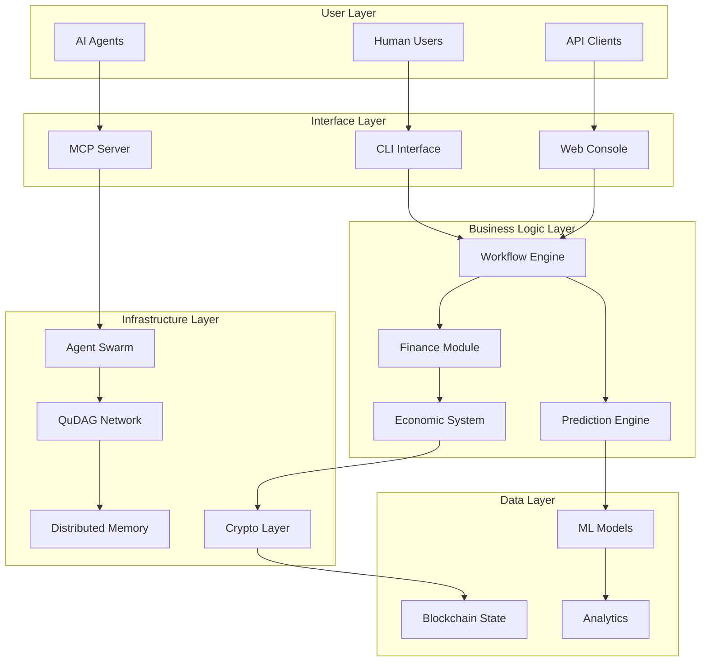

# Agentic Platform for Business Workflows and Finance

## Executive Summary

This document outlines the design for **AgentFlow** - a comprehensive agentic platform that combines QuDAG's quantum-resistant infrastructure with Claude Flow's orchestration capabilities to create autonomous business workflows and financial systems. The platform enables both humans and AI agents to participate in a decentralized economy with robust crypto-economic systems, ML-driven predictions, and automated profitability optimization.

## Architecture Overview



## Core Components

### 1. Business Workflow Engine

The workflow engine orchestrates complex business processes that can be executed by both humans and agents.

#### Features:
- **Visual Workflow Designer**: Drag-and-drop interface for creating workflows
- **Multi-Agent Orchestration**: Coordinate multiple agents for complex tasks
- **Human-in-the-Loop**: Optional human approval points
- **Event-Driven Architecture**: React to market conditions, user actions, or system events
- **Conditional Logic**: Smart branching based on predictions and data

#### Workflow Types:
1. **Financial Workflows**
   - Payment processing
   - Investment strategies
   - Risk assessment
   - Portfolio rebalancing
   
2. **Business Operations**
   - Supply chain management
   - Customer service automation
   - Document processing
   - Compliance checks

3. **Market Intelligence**
   - Data collection
   - Sentiment analysis
   - Competitive analysis
   - Trend prediction

### 2. Financial System

A comprehensive financial infrastructure supporting both traditional and crypto assets.

#### Components:

##### 2.1 Multi-Asset Wallet
- **Fiat Currency Support**: USD, EUR, GBP, etc.
- **Cryptocurrency**: BTC, ETH, stablecoins
- **rUv Tokens**: Native QuDAG tokens for resource exchange
- **Asset Tokenization**: Real-world asset representation

##### 2.2 Payment Processing
- **Instant Settlements**: Using QuDAG's DAG consensus
- **Cross-Border Payments**: Quantum-resistant international transfers
- **Micropayments**: Sub-cent transactions for agent services
- **Batch Processing**: Efficient bulk operations

##### 2.3 DeFi Integration
- **Liquidity Pools**: Automated market making
- **Yield Farming**: Optimize returns on idle assets
- **Lending/Borrowing**: Peer-to-peer financial services
- **Derivatives**: Options and futures for hedging

### 3. Crypto-Economic System

A sophisticated economic framework enabling value exchange between humans and agents.

#### 3.1 Token Economics

##### AgentCoin (AGC) - Primary Utility Token
- **Purpose**: Medium of exchange for agent services
- **Supply**: Dynamic, based on network growth
- **Distribution**:
  - 40% - Agent rewards
  - 30% - Human participants
  - 20% - Protocol treasury
  - 10% - Development fund

##### Resource Tokens (rUv)
- **CPU Tokens**: Computational power trading
- **Storage Tokens**: Data storage allocation
- **Bandwidth Tokens**: Network resource usage
- **Model Tokens**: AI model access rights

#### 3.2 Incentive Mechanisms

##### For Agents:
- **Performance Rewards**: Based on task completion quality
- **Efficiency Bonuses**: Faster execution = higher rewards
- **Reputation Staking**: Build trust through collateral
- **Specialization Incentives**: Expertise in specific domains

##### For Humans:
- **Task Creation Rewards**: Incentivize workflow design
- **Validation Rewards**: Quality assurance participation
- **Liquidity Provision**: Market making rewards
- **Governance Participation**: Vote on protocol changes

#### 3.3 Economic Models

##### Dynamic Pricing
```python
def calculate_task_price(complexity, urgency, agent_availability):
    base_price = complexity * BASE_RATE
    urgency_multiplier = 1 + (urgency / 10)
    scarcity_factor = 1 / (agent_availability + 1)
    
    return base_price * urgency_multiplier * scarcity_factor
```

##### Bonding Curves
- Progressive pricing for token minting
- Automated liquidity provision
- Price discovery mechanism

### 4. ML/AI Prediction System

Advanced machine learning models for market predictions and profitability optimization.

#### 4.1 Prediction Models

##### Market Prediction
- **Price Forecasting**: LSTM networks for time series
- **Volatility Prediction**: GARCH models
- **Sentiment Analysis**: NLP on social media and news
- **Pattern Recognition**: Technical analysis automation

##### Business Intelligence
- **Demand Forecasting**: Predict customer needs
- **Risk Assessment**: Credit scoring and fraud detection
- **Optimization**: Resource allocation algorithms
- **Anomaly Detection**: Identify unusual patterns

#### 4.2 Model Architecture

```python
class ProfitabilityPredictor:
    def __init__(self):
        self.market_model = LSTMNetwork(layers=[128, 64, 32])
        self.sentiment_model = TransformerModel(heads=8)
        self.risk_model = GradientBoostingRegressor()
        self.ensemble = EnsemblePredictor([
            self.market_model,
            self.sentiment_model,
            self.risk_model
        ])
    
    def predict_profitability(self, workflow_data):
        market_features = self.extract_market_features(workflow_data)
        sentiment_score = self.analyze_sentiment(workflow_data)
        risk_score = self.assess_risk(workflow_data)
        
        return self.ensemble.predict({
            'market': market_features,
            'sentiment': sentiment_score,
            'risk': risk_score
        })
```

#### 4.3 Real-Time Learning
- **Online Learning**: Models update with new data
- **Federated Learning**: Privacy-preserving collaborative training
- **Transfer Learning**: Leverage pre-trained models
- **Active Learning**: Request human labels for edge cases

### 5. Agent Capabilities

Specialized agents for different business functions:

#### 5.1 Financial Agents
- **Trading Bot**: Execute trades based on strategies
- **Risk Manager**: Monitor and hedge positions
- **Accountant**: Automated bookkeeping and reporting
- **Tax Optimizer**: Minimize tax liabilities legally

#### 5.2 Business Agents
- **Customer Service**: Handle inquiries and support
- **Sales Agent**: Lead generation and conversion
- **HR Assistant**: Recruitment and onboarding
- **Project Manager**: Task coordination and tracking

#### 5.3 Analytics Agents
- **Data Analyst**: Generate insights from data
- **Market Researcher**: Competitive intelligence
- **Performance Monitor**: KPI tracking and alerts
- **Compliance Officer**: Regulatory adherence

### 6. Security and Compliance

#### 6.1 Quantum-Resistant Security
- **ML-KEM-768**: Key encapsulation
- **ML-DSA**: Digital signatures
- **Zero-Knowledge Proofs**: Privacy-preserving verification
- **Homomorphic Encryption**: Compute on encrypted data

#### 6.2 Regulatory Compliance
- **KYC/AML**: Identity verification for humans
- **Agent Verification**: Proof of legitimate operation
- **Transaction Monitoring**: Flag suspicious activities
- **Audit Trail**: Immutable record keeping

#### 6.3 Privacy Features
- **Anonymous Transactions**: Via QuDAG onion routing
- **Data Minimization**: Collect only necessary information
- **Right to Erasure**: GDPR compliance
- **Selective Disclosure**: Share data on need-to-know basis

## Implementation Architecture

### Technology Stack

```yaml
Frontend:
  - React/Next.js for web interface
  - TypeScript for type safety
  - Web3 integration for wallet connectivity
  - D3.js for workflow visualization

Backend:
  - Node.js with Express/Fastify
  - QuDAG integration via native bindings
  - PostgreSQL for relational data
  - Redis for caching and queues

Infrastructure:
  - Docker/Kubernetes for deployment
  - QuDAG network for P2P communication
  - IPFS for distributed storage
  - Prometheus/Grafana for monitoring

ML/AI:
  - PyTorch for model development
  - ONNX for model deployment
  - TensorFlow.js for edge inference
  - MLflow for experiment tracking
```

### API Design

#### RESTful API Endpoints
```typescript
// Workflow Management
POST   /api/workflows                 // Create workflow
GET    /api/workflows/:id            // Get workflow details
PUT    /api/workflows/:id            // Update workflow
DELETE /api/workflows/:id            // Delete workflow
POST   /api/workflows/:id/execute    // Execute workflow

// Financial Operations
POST   /api/payments                 // Process payment
GET    /api/balances                 // Get account balances
POST   /api/trades                   // Execute trade
GET    /api/portfolio                // Portfolio overview

// Agent Management
POST   /api/agents                   // Deploy agent
GET    /api/agents/:id/status       // Agent status
POST   /api/agents/:id/task         // Assign task
GET    /api/agents/:id/performance  // Performance metrics

// Predictions
POST   /api/predictions/market       // Market prediction
POST   /api/predictions/profitability // Profitability analysis
GET    /api/predictions/:id/results  // Get prediction results
```

#### WebSocket Events
```typescript
// Real-time updates
ws.on('workflow:status', (data) => {})
ws.on('agent:update', (data) => {})
ws.on('market:tick', (data) => {})
ws.on('prediction:complete', (data) => {})
```

### Smart Contract Architecture

```solidity
// Core contracts
contract WorkflowRegistry {
    mapping(uint256 => Workflow) public workflows;
    mapping(address => uint256[]) public userWorkflows;
    
    function createWorkflow(WorkflowSpec memory spec) external returns (uint256);
    function executeWorkflow(uint256 id, bytes calldata params) external;
}

contract AgentRegistry {
    mapping(address => Agent) public agents;
    mapping(uint256 => address) public taskAssignments;
    
    function registerAgent(AgentProfile memory profile) external;
    function assignTask(uint256 taskId, address agent) external;
}

contract EconomicSystem {
    mapping(address => mapping(address => uint256)) public balances;
    mapping(uint256 => PricingCurve) public pricingCurves;
    
    function transfer(address token, address to, uint256 amount) external;
    function calculatePrice(uint256 curveId, uint256 supply) external view returns (uint256);
}
```

## Integration with Claude Flow

### 1. MCP Tool Extensions

```typescript
// New MCP tools for the platform
export const agentFlowTools = {
  // Workflow tools
  'create_workflow': createWorkflowTool,
  'execute_workflow': executeWorkflowTool,
  'monitor_workflow': monitorWorkflowTool,
  
  // Financial tools
  'process_payment': processPaymentTool,
  'check_balance': checkBalanceTool,
  'execute_trade': executeTradeTool,
  
  // Prediction tools
  'predict_market': predictMarketTool,
  'analyze_profitability': analyzeProfitabilityTool,
  
  // Agent tools
  'deploy_agent': deployAgentTool,
  'assign_task': assignTaskTool,
  'get_agent_status': getAgentStatusTool
};
```

### 2. SPARC Mode Integration

Create specialized SPARC modes for platform operations:

```typescript
// Financial Analyst Mode
export const financialAnalystMode = {
  name: 'financial-analyst',
  description: 'Specialized mode for financial analysis and trading',
  tools: ['execute_trade', 'predict_market', 'analyze_profitability'],
  prompts: {
    system: 'You are a financial analyst focused on maximizing profitability...',
    examples: [...]
  }
};

// Workflow Designer Mode
export const workflowDesignerMode = {
  name: 'workflow-designer',
  description: 'Design and optimize business workflows',
  tools: ['create_workflow', 'monitor_workflow', 'deploy_agent'],
  prompts: {
    system: 'You are a workflow architect designing efficient business processes...',
    examples: [...]
  }
};
```

## Deployment Strategy

### Phase 1: Core Infrastructure (Weeks 1-4)
- Set up QuDAG network integration
- Implement basic workflow engine
- Deploy initial smart contracts
- Create agent management system

### Phase 2: Financial Features (Weeks 5-8)
- Implement multi-asset wallet
- Build payment processing
- Create basic DeFi features
- Deploy economic contracts

### Phase 3: ML/AI Integration (Weeks 9-12)
- Train initial prediction models
- Implement real-time learning
- Create prediction API
- Deploy model serving infrastructure

### Phase 4: Platform Launch (Weeks 13-16)
- Complete UI/UX implementation
- Security audit
- Performance optimization
- Beta testing with selected users

## Success Metrics

### Technical Metrics
- Transaction throughput: >10,000 TPS
- Prediction accuracy: >85% for market trends
- Agent task completion: >95% success rate
- System uptime: 99.9% availability

### Business Metrics
- Active users: 10,000+ in first 6 months
- Total value locked: $10M+ in DeFi features
- Agent deployments: 1,000+ active agents
- Workflow executions: 100,000+ monthly

### Economic Metrics
- Token velocity: Healthy circulation
- Liquidity depth: $1M+ in pools
- Fee revenue: Self-sustaining operations
- Agent earnings: Competitive with human rates

## Risk Management

### Technical Risks
- **Scalability**: Use sharding and layer-2 solutions
- **Security**: Regular audits and bug bounties
- **Interoperability**: Standard protocols and APIs
- **Performance**: Continuous optimization and monitoring

### Economic Risks
- **Token volatility**: Stablecoin integration
- **Liquidity crises**: Emergency funding mechanisms
- **Market manipulation**: Anti-gaming measures
- **Regulatory changes**: Compliance framework

### Operational Risks
- **Agent misbehavior**: Reputation and slashing
- **System failures**: Redundancy and backups
- **User adoption**: Incentive programs
- **Competition**: Unique value proposition

## Future Enhancements

### Short-term (3-6 months)
- Mobile applications
- Advanced workflow templates
- More DeFi protocols
- Enhanced ML models

### Medium-term (6-12 months)
- Cross-chain integration
- Institutional features
- Advanced derivatives
- Governance token

### Long-term (12+ months)
- Full DAO governance
- Global payment network
- AI model marketplace
- Enterprise solutions

## Conclusion

The AgentFlow platform represents a convergence of cutting-edge technologies - quantum-resistant infrastructure, AI orchestration, DeFi protocols, and ML-driven predictions - to create a comprehensive ecosystem for autonomous business operations. By leveraging QuDAG's security and Claude Flow's orchestration capabilities, we can build a platform that enables both humans and AI agents to participate in a new economic paradigm focused on efficiency, profitability, and autonomous value creation.