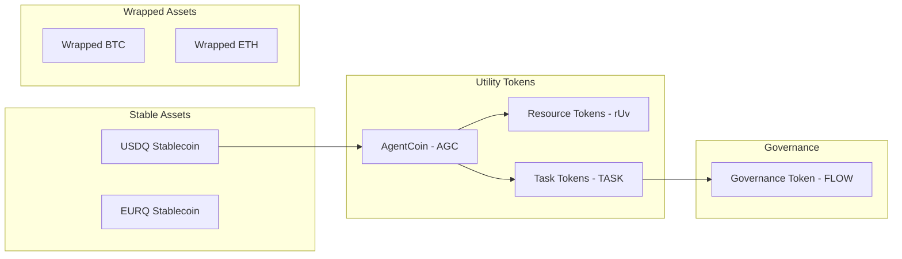

# Crypto-Economic System Design

## Overview

This document details the comprehensive crypto-economic system that enables value exchange between humans and AI agents in the AgentFlow platform. The system is designed to create sustainable economic incentives while ensuring fair compensation for both human participants and autonomous agents.

## Token Architecture

### 1. Multi-Token Ecosystem



### 2. Token Specifications

#### 2.1 AgentCoin (AGC) - Primary Utility Token

**Technical Specification:**
```solidity
contract AgentCoin is ERC20, Pausable, AccessControl {
    uint256 public constant INITIAL_SUPPLY = 1_000_000_000 * 10**18; // 1 billion
    uint256 public constant MAX_SUPPLY = 10_000_000_000 * 10**18; // 10 billion
    
    // Dynamic minting based on network growth
    uint256 public mintingRate = 2; // 2% annual inflation
    uint256 public lastMintTimestamp;
    
    // Burn mechanism for deflationary pressure
    uint256 public burnRate = 0.1; // 0.1% per transaction
    
    function mint(address to, uint256 amount) public onlyRole(MINTER_ROLE) {
        require(totalSupply() + amount <= MAX_SUPPLY, "Max supply exceeded");
        _mint(to, amount);
    }
    
    function burn(uint256 amount) public {
        _burn(msg.sender, amount);
    }
}
```

**Distribution Model:**
- **Initial Distribution:**
  - 20% - Public sale
  - 15% - Team (4-year vesting)
  - 10% - Advisors (2-year vesting)
  - 40% - Ecosystem rewards
  - 10% - Treasury
  - 5% - Liquidity provision

- **Ongoing Distribution:**
  - Agent rewards: 40%
  - Human validators: 20%
  - Liquidity providers: 15%
  - Development fund: 15%
  - Burn mechanism: 10%

#### 2.2 Resource Tokens (rUv System)

**Token Types:**
```typescript
interface ResourceToken {
    CPU: "ruv-cpu",      // Computational power
    Storage: "ruv-store", // Storage capacity
    Bandwidth: "ruv-band", // Network bandwidth
    Model: "ruv-model",   // AI model access
    Memory: "ruv-mem"     // RAM allocation
}
```

**Dynamic Pricing Model:**
```python
class ResourcePricing:
    def __init__(self):
        self.base_prices = {
            'CPU': 0.001,      # AGC per CPU-second
            'Storage': 0.0001, # AGC per GB-hour
            'Bandwidth': 0.002, # AGC per GB
            'Model': 0.01,     # AGC per inference
            'Memory': 0.0005   # AGC per GB-hour
        }
    
    def calculate_price(self, resource_type, amount, demand_factor):
        base_price = self.base_prices[resource_type]
        
        # Dynamic pricing based on supply/demand
        scarcity_multiplier = 1 + (demand_factor - 0.5) * 2
        
        # Time-based pricing (peak hours cost more)
        time_multiplier = self.get_time_multiplier()
        
        # Quality of service multiplier
        qos_multiplier = self.get_qos_multiplier(resource_type)
        
        return base_price * amount * scarcity_multiplier * time_multiplier * qos_multiplier
```

#### 2.3 Task Tokens (TASK)

**Purpose:** Represent claims on future task completions

**Mechanics:**
```solidity
contract TaskToken is ERC721 {
    struct Task {
        uint256 id;
        address requester;
        uint256 bounty;
        uint256 deadline;
        string ipfsHash; // Task specification
        TaskStatus status;
        address assignedAgent;
        uint256 qualityScore;
    }
    
    enum TaskStatus { Open, Assigned, InProgress, UnderReview, Completed, Disputed }
    
    mapping(uint256 => Task) public tasks;
    
    function createTask(uint256 bounty, uint256 deadline, string memory ipfsHash) 
        external payable returns (uint256) {
        // Create NFT representing task ownership
    }
    
    function assignTask(uint256 taskId, address agent) external {
        // Assignment logic with reputation check
    }
    
    function completeTask(uint256 taskId, string memory resultHash) external {
        // Completion and payment logic
    }
}
```

### 3. Economic Mechanisms

#### 3.1 Automated Market Maker (AMM)

**Bonding Curve Implementation:**
```python
class BondingCurveAMM:
    def __init__(self, reserve_ratio=0.5):
        self.reserve_ratio = reserve_ratio
        self.token_supply = 1000000  # Initial supply
        self.reserve_balance = 100000  # Initial reserve in USDQ
    
    def calculate_purchase_price(self, tokens_to_buy):
        """Calculate price for buying tokens from the curve"""
        new_supply = self.token_supply + tokens_to_buy
        new_reserve = new_supply ** (1 / self.reserve_ratio)
        cost = new_reserve - self.reserve_balance
        return cost
    
    def calculate_sale_return(self, tokens_to_sell):
        """Calculate return for selling tokens to the curve"""
        new_supply = self.token_supply - tokens_to_sell
        new_reserve = new_supply ** (1 / self.reserve_ratio)
        return_amount = self.reserve_balance - new_reserve
        return return_amount
    
    def buy_tokens(self, payment_amount):
        """Buy tokens with USDQ"""
        tokens_received = (
            (self.reserve_balance + payment_amount) ** self.reserve_ratio
            - self.token_supply
        )
        self.token_supply += tokens_received
        self.reserve_balance += payment_amount
        return tokens_received
    
    def sell_tokens(self, token_amount):
        """Sell tokens for USDQ"""
        payment_received = self.calculate_sale_return(token_amount)
        self.token_supply -= token_amount
        self.reserve_balance -= payment_received
        return payment_received
```

#### 3.2 Staking Mechanisms

**Agent Staking for Reputation:**
```solidity
contract AgentStaking {
    struct Stake {
        uint256 amount;
        uint256 timestamp;
        uint256 reputationScore;
        uint256 slashingHistory;
    }
    
    mapping(address => Stake) public agentStakes;
    uint256 public constant MIN_STAKE = 1000 * 10**18; // 1000 AGC
    uint256 public constant REPUTATION_DECAY_RATE = 1; // 1% per week
    
    function stakeAsAgent(uint256 amount) external {
        require(amount >= MIN_STAKE, "Insufficient stake");
        require(agentStakes[msg.sender].amount == 0, "Already staked");
        
        // Transfer tokens to contract
        IERC20(agentCoin).transferFrom(msg.sender, address(this), amount);
        
        agentStakes[msg.sender] = Stake({
            amount: amount,
            timestamp: block.timestamp,
            reputationScore: 100, // Base reputation
            slashingHistory: 0
        });
        
        emit AgentStaked(msg.sender, amount);
    }
    
    function updateReputation(address agent, int256 change) external onlyRole(REPUTATION_ORACLE) {
        Stake storage stake = agentStakes[agent];
        
        if (change > 0) {
            stake.reputationScore += uint256(change);
        } else {
            uint256 decrease = uint256(-change);
            if (decrease > stake.reputationScore) {
                stake.reputationScore = 0;
                // Trigger slashing if reputation too low
                _slashStake(agent, stake.amount / 10); // 10% slash
            } else {
                stake.reputationScore -= decrease;
            }
        }
    }
}
```

**Liquidity Staking:**
```solidity
contract LiquidityStaking {
    struct LiquidityPosition {
        uint256 lpTokens;
        uint256 stakedAt;
        uint256 rewardsEarned;
        uint256 lastClaimTime;
    }
    
    mapping(address => LiquidityPosition) public positions;
    uint256 public rewardRate = 100; // AGC per day per 1000 LP tokens
    
    function stakeLiquidity(uint256 lpTokenAmount) external {
        // Stake LP tokens and start earning rewards
    }
    
    function calculateRewards(address user) public view returns (uint256) {
        LiquidityPosition memory pos = positions[user];
        uint256 timeStaked = block.timestamp - pos.lastClaimTime;
        uint256 rewards = (pos.lpTokens * rewardRate * timeStaked) / (1000 * 1 days);
        return rewards;
    }
}
```

#### 3.3 Fee Structure

**Transaction Fees:**
```typescript
interface FeeStructure {
    // Base fees
    taskCreation: 0.1,      // 0.1% of task bounty
    taskCompletion: 0.5,    // 0.5% of payment
    resourceTrading: 0.2,   // 0.2% of trade value
    
    // Dynamic fees based on network congestion
    congestionMultiplier: (utilization: number) => {
        if (utilization < 0.5) return 1;
        if (utilization < 0.8) return 1.5;
        return 2;
    },
    
    // Discounts for stakers
    stakerDiscount: (stakeAmount: number) => {
        if (stakeAmount >= 10000) return 0.5;  // 50% discount
        if (stakeAmount >= 5000) return 0.75;  // 25% discount
        return 1; // No discount
    }
}
```

### 4. Incentive Design

#### 4.1 Agent Incentives

**Performance-Based Rewards:**
```python
class AgentRewardCalculator:
    def __init__(self):
        self.base_reward = 10  # Base AGC per task
        self.quality_multipliers = {
            'excellent': 2.0,
            'good': 1.5,
            'satisfactory': 1.0,
            'poor': 0.5
        }
    
    def calculate_reward(self, task_complexity, completion_time, quality_score):
        # Complexity bonus
        complexity_bonus = task_complexity * 0.1
        
        # Speed bonus (faster completion = higher reward)
        expected_time = self.get_expected_time(task_complexity)
        speed_bonus = max(0, (expected_time - completion_time) / expected_time)
        
        # Quality multiplier
        quality_mult = self.quality_multipliers[self.get_quality_tier(quality_score)]
        
        # Reputation bonus
        reputation_bonus = self.get_reputation_bonus(agent_address)
        
        total_reward = self.base_reward * (
            1 + complexity_bonus + speed_bonus
        ) * quality_mult * (1 + reputation_bonus)
        
        return total_reward
```

**Specialization Rewards:**
```solidity
contract SpecializationRewards {
    mapping(address => mapping(string => uint256)) public agentSpecializations;
    mapping(string => uint256) public specializationMultipliers;
    
    function recordTaskCompletion(
        address agent, 
        string memory category, 
        uint256 qualityScore
    ) external {
        agentSpecializations[agent][category] += qualityScore;
        
        // Award specialization bonus if threshold met
        if (agentSpecializations[agent][category] >= 1000) {
            specializationMultipliers[category] = 150; // 1.5x rewards
        }
    }
}
```

#### 4.2 Human Incentives

**Task Creation Rewards:**
- Quality tasks that get completed: 1% of task value
- Tasks that train new agents: 2% bonus
- Recurring workflow creation: 0.1% of all executions

**Validation Rewards:**
```python
class ValidationRewards:
    def __init__(self):
        self.base_validation_reward = 0.5  # AGC per validation
        self.accuracy_threshold = 0.8
        
    def calculate_validation_reward(self, validator_accuracy, stake_amount):
        if validator_accuracy < self.accuracy_threshold:
            return 0  # No reward for poor validators
        
        accuracy_bonus = (validator_accuracy - self.accuracy_threshold) * 5
        stake_bonus = math.log10(stake_amount + 1) * 0.1
        
        return self.base_validation_reward * (1 + accuracy_bonus + stake_bonus)
```

### 5. Economic Security

#### 5.1 Anti-Gaming Mechanisms

**Sybil Resistance:**
```solidity
contract SybilResistance {
    uint256 public constant PROOF_OF_WORK_DIFFICULTY = 20;
    mapping(address => uint256) public registrationTime;
    mapping(address => bytes32) public proofOfWork;
    
    function registerAgent(bytes32 pow) external {
        require(verifyPoW(msg.sender, pow), "Invalid PoW");
        require(registrationTime[msg.sender] == 0, "Already registered");
        
        registrationTime[msg.sender] = block.timestamp;
        proofOfWork[msg.sender] = pow;
    }
    
    function verifyPoW(address agent, bytes32 pow) internal pure returns (bool) {
        return uint256(keccak256(abi.encodePacked(agent, pow))) < 2**PROOF_OF_WORK_DIFFICULTY;
    }
}
```

**Wash Trading Prevention:**
```python
class WashTradingDetector:
    def __init__(self):
        self.suspicious_patterns = []
        self.min_time_between_trades = 300  # 5 minutes
        
    def detect_wash_trading(self, trade_history):
        for i in range(len(trade_history) - 1):
            current = trade_history[i]
            next_trade = trade_history[i + 1]
            
            # Check for round-trip trades
            if (current.from_addr == next_trade.to_addr and 
                current.to_addr == next_trade.from_addr and
                abs(current.amount - next_trade.amount) < 0.01):
                
                time_diff = next_trade.timestamp - current.timestamp
                if time_diff < self.min_time_between_trades:
                    self.suspicious_patterns.append({
                        'type': 'wash_trade',
                        'trades': [current, next_trade],
                        'confidence': 0.9
                    })
        
        return self.suspicious_patterns
```

#### 5.2 Emergency Mechanisms

**Circuit Breakers:**
```solidity
contract CircuitBreaker {
    uint256 public constant PRICE_DEVIATION_THRESHOLD = 20; // 20%
    uint256 public constant VOLUME_SPIKE_THRESHOLD = 500; // 500%
    uint256 public constant COOLDOWN_PERIOD = 1 hours;
    
    bool public tradingPaused;
    uint256 public pausedUntil;
    
    function checkCircuitBreaker(
        uint256 currentPrice, 
        uint256 avgPrice, 
        uint256 currentVolume, 
        uint256 avgVolume
    ) external {
        uint256 priceDeviation = abs(currentPrice - avgPrice) * 100 / avgPrice;
        uint256 volumeSpike = currentVolume * 100 / avgVolume;
        
        if (priceDeviation > PRICE_DEVIATION_THRESHOLD || 
            volumeSpike > VOLUME_SPIKE_THRESHOLD) {
            tradingPaused = true;
            pausedUntil = block.timestamp + COOLDOWN_PERIOD;
            emit CircuitBreakerTriggered(priceDeviation, volumeSpike);
        }
    }
}
```

### 6. Governance Integration

#### 6.1 DAO Structure

**Governance Token (FLOW):**
```solidity
contract GovernanceToken is ERC20Votes {
    mapping(address => uint256) public votingPower;
    mapping(address => uint256) public delegatedPower;
    
    function calculateVotingPower(address account) public view returns (uint256) {
        uint256 tokenBalance = balanceOf(account);
        uint256 stakedAGC = getStakedAGC(account);
        uint256 reputationScore = getReputationScore(account);
        
        // Quadratic voting to prevent whale dominance
        uint256 sqrtBalance = sqrt(tokenBalance);
        uint256 sqrtStaked = sqrt(stakedAGC);
        
        // Reputation multiplier (max 2x)
        uint256 repMultiplier = 100 + min(reputationScore, 100);
        
        return (sqrtBalance + sqrtStaked) * repMultiplier / 100;
    }
}
```

**Proposal System:**
```python
class GovernanceProposal:
    def __init__(self, proposal_id, proposer, description):
        self.id = proposal_id
        self.proposer = proposer
        self.description = description
        self.for_votes = 0
        self.against_votes = 0
        self.abstain_votes = 0
        self.status = "pending"
        self.execution_delay = 48 * 3600  # 48 hours
        
    def cast_vote(self, voter, vote_type, voting_power):
        if vote_type == "for":
            self.for_votes += voting_power
        elif vote_type == "against":
            self.against_votes += voting_power
        else:
            self.abstain_votes += voting_power
    
    def check_quorum(self, total_voting_power):
        participation = (self.for_votes + self.against_votes + self.abstain_votes) / total_voting_power
        return participation >= 0.1  # 10% quorum
    
    def check_approval(self):
        if self.for_votes + self.against_votes == 0:
            return False
        return self.for_votes / (self.for_votes + self.against_votes) > 0.5
```

### 7. Cross-Chain Integration

#### 7.1 Bridge Design

**Asset Bridge:**
```solidity
contract CrossChainBridge {
    mapping(address => mapping(uint256 => bool)) public processedNonces;
    mapping(address => uint256) public chainBalances;
    
    event AssetLocked(address token, address user, uint256 amount, uint256 targetChain);
    event AssetReleased(address token, address user, uint256 amount, uint256 sourceChain);
    
    function lockAssets(address token, uint256 amount, uint256 targetChain) external {
        IERC20(token).transferFrom(msg.sender, address(this), amount);
        
        uint256 nonce = generateNonce();
        emit AssetLocked(token, msg.sender, amount, targetChain);
    }
    
    function releaseAssets(
        address token,
        address recipient,
        uint256 amount,
        uint256 sourceChain,
        bytes memory signature
    ) external onlyRelayer {
        // Verify signature and release assets
    }
}
```

### 8. Economic Modeling

#### 8.1 Token Velocity

```python
class TokenVelocityModel:
    def __init__(self):
        self.transactions_per_day = []
        self.unique_addresses_per_day = []
        self.total_supply = 1_000_000_000
        
    def calculate_velocity(self, time_period_days=30):
        total_volume = sum(self.transactions_per_day[-time_period_days:])
        avg_circulating_supply = self.total_supply * 0.3  # 30% circulating
        
        velocity = total_volume / avg_circulating_supply
        return velocity
    
    def calculate_optimal_velocity(self):
        # Target velocity between 5-20 for healthy economy
        return 10
    
    def suggest_interventions(self, current_velocity):
        if current_velocity < 5:
            return ["Increase rewards", "Reduce staking incentives", "Launch marketing campaign"]
        elif current_velocity > 20:
            return ["Increase staking rewards", "Introduce lock-up periods", "Burn mechanisms"]
        return ["Maintain current parameters"]
```

#### 8.2 Supply/Demand Dynamics

```python
class SupplyDemandModel:
    def __init__(self):
        self.agent_supply = 1000
        self.task_demand = 5000
        self.price_elasticity = 0.8
        
    def calculate_equilibrium_price(self):
        supply_demand_ratio = self.agent_supply / self.task_demand
        base_price = 10  # AGC
        
        # Price increases when demand exceeds supply
        if supply_demand_ratio < 1:
            price_multiplier = 1 / (supply_demand_ratio ** self.price_elasticity)
        else:
            price_multiplier = supply_demand_ratio ** (self.price_elasticity / 2)
        
        return base_price * price_multiplier
    
    def predict_market_dynamics(self, time_horizon_days):
        predictions = []
        
        for day in range(time_horizon_days):
            # Model agent growth
            self.agent_supply *= 1.02  # 2% daily growth
            
            # Model task demand (more volatile)
            demand_change = random.gauss(1.03, 0.1)  # 3% avg growth, 10% volatility
            self.task_demand *= demand_change
            
            equilibrium_price = self.calculate_equilibrium_price()
            predictions.append({
                'day': day,
                'price': equilibrium_price,
                'supply': self.agent_supply,
                'demand': self.task_demand
            })
        
        return predictions
```

### 9. Implementation Roadmap

#### Phase 1: Token Launch (Month 1-2)
- Deploy AGC token contract
- Launch initial liquidity pools
- Implement basic staking mechanisms
- Create token distribution contracts

#### Phase 2: Economic Infrastructure (Month 3-4)
- Deploy AMM with bonding curves
- Implement fee structure
- Launch resource token system
- Create bridge contracts

#### Phase 3: Incentive Systems (Month 5-6)
- Deploy agent reward calculator
- Implement specialization bonuses
- Launch validation rewards
- Create anti-gaming mechanisms

#### Phase 4: Governance (Month 7-8)
- Deploy FLOW governance token
- Implement proposal system
- Create voting mechanisms
- Launch DAO treasury

### 10. Risk Mitigation

#### Economic Risks
- **Hyperinflation**: Controlled minting with max supply cap
- **Deflation**: Minimum inflation rate and burn limits
- **Market manipulation**: Circuit breakers and monitoring
- **Liquidity crisis**: Reserve funds and emergency minting

#### Technical Risks
- **Smart contract bugs**: Formal verification and audits
- **Oracle failures**: Multiple oracle sources
- **Bridge hacks**: Time delays and multi-sig controls
- **Scalability issues**: Layer 2 solutions ready

#### Regulatory Risks
- **Securities classification**: Utility token design
- **KYC requirements**: Modular compliance layer
- **Tax implications**: Clear documentation
- **Cross-border restrictions**: Geo-fencing capabilities

## Conclusion

This crypto-economic system creates a sustainable ecosystem where both humans and AI agents can participate in value creation and exchange. The multi-token architecture provides flexibility, the incentive mechanisms ensure quality, and the governance structure enables community-driven evolution. With careful implementation and monitoring, this system can support the growth of autonomous business workflows while maintaining economic stability and fairness.