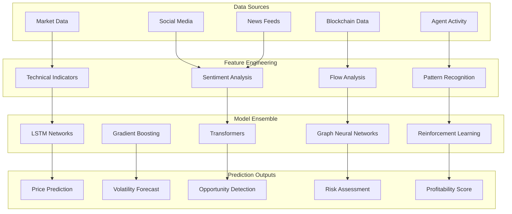

# ML/AI Models for Rapid Predictions and Profitability

## Overview

This document outlines the comprehensive machine learning and AI model architecture designed to maximize profitability through rapid predictions in the AgentFlow platform. The system combines state-of-the-art deep learning models with real-time data processing to provide actionable insights for both human traders and autonomous agents.

## Model Architecture Overview



## 1. Core Prediction Models

### 1.1 Market Price Prediction

#### LSTM-Attention Model Architecture

```python
import torch
import torch.nn as nn
import torch.nn.functional as F

class MarketPriceLSTM(nn.Module):
    def __init__(self, input_dim=50, hidden_dim=256, num_layers=4, dropout=0.2):
        super(MarketPriceLSTM, self).__init__()
        
        # Multi-layer LSTM with dropout
        self.lstm = nn.LSTM(
            input_dim, 
            hidden_dim, 
            num_layers, 
            batch_first=True,
            dropout=dropout,
            bidirectional=True
        )
        
        # Attention mechanism
        self.attention = nn.MultiheadAttention(
            embed_dim=hidden_dim * 2,
            num_heads=8,
            dropout=dropout
        )
        
        # Feature extraction layers
        self.feature_extractor = nn.Sequential(
            nn.Linear(hidden_dim * 2, hidden_dim),
            nn.ReLU(),
            nn.Dropout(dropout),
            nn.Linear(hidden_dim, hidden_dim // 2),
            nn.ReLU(),
            nn.Dropout(dropout)
        )
        
        # Prediction heads
        self.price_head = nn.Linear(hidden_dim // 2, 1)
        self.confidence_head = nn.Linear(hidden_dim // 2, 1)
        self.direction_head = nn.Linear(hidden_dim // 2, 3)  # Up, Down, Neutral
        
    def forward(self, x, market_context=None):
        # LSTM processing
        lstm_out, (hidden, cell) = self.lstm(x)
        
        # Apply attention
        attended, attention_weights = self.attention(
            lstm_out, lstm_out, lstm_out
        )
        
        # Combine LSTM output with attention
        combined = lstm_out + attended
        
        # Global max pooling
        pooled = F.max_pool1d(
            combined.transpose(1, 2), 
            kernel_size=combined.size(1)
        ).squeeze(2)
        
        # Feature extraction
        features = self.feature_extractor(pooled)
        
        # Generate predictions
        price_pred = self.price_head(features)
        confidence = torch.sigmoid(self.confidence_head(features))
        direction = F.softmax(self.direction_head(features), dim=-1)
        
        return {
            'price': price_pred,
            'confidence': confidence,
            'direction': direction,
            'attention_weights': attention_weights
        }
```

#### Technical Indicator Processing

```python
class TechnicalIndicatorProcessor:
    def __init__(self):
        self.indicators = {
            'sma': [5, 10, 20, 50, 200],
            'ema': [12, 26, 50, 200],
            'rsi': [14, 21],
            'macd': [(12, 26, 9)],
            'bb': [(20, 2)],
            'volume': ['vwap', 'obv', 'mfi']
        }
    
    def calculate_features(self, ohlcv_data):
        features = []
        
        # Price-based features
        features.extend(self._calculate_moving_averages(ohlcv_data))
        features.extend(self._calculate_momentum_indicators(ohlcv_data))
        features.extend(self._calculate_volatility_indicators(ohlcv_data))
        
        # Volume-based features
        features.extend(self._calculate_volume_indicators(ohlcv_data))
        
        # Pattern recognition
        features.extend(self._detect_candlestick_patterns(ohlcv_data))
        
        # Market microstructure
        features.extend(self._calculate_microstructure_features(ohlcv_data))
        
        return np.array(features)
    
    def _calculate_moving_averages(self, data):
        close_prices = data['close']
        features = []
        
        for period in self.indicators['sma']:
            sma = close_prices.rolling(window=period).mean()
            features.append(close_prices[-1] / sma[-1] - 1)  # Relative position
        
        for period in self.indicators['ema']:
            ema = close_prices.ewm(span=period).mean()
            features.append(close_prices[-1] / ema[-1] - 1)
        
        return features
```

### 1.2 Sentiment Analysis Model

#### Transformer-Based Sentiment Analyzer

```python
class MarketSentimentTransformer(nn.Module):
    def __init__(self, vocab_size=50000, embed_dim=768, num_heads=12, num_layers=6):
        super(MarketSentimentTransformer, self).__init__()
        
        # Token and position embeddings
        self.token_embedding = nn.Embedding(vocab_size, embed_dim)
        self.position_embedding = nn.Embedding(512, embed_dim)
        
        # Transformer encoder
        encoder_layer = nn.TransformerEncoderLayer(
            d_model=embed_dim,
            nhead=num_heads,
            dim_feedforward=3072,
            dropout=0.1,
            activation='gelu'
        )
        self.transformer = nn.TransformerEncoder(encoder_layer, num_layers)
        
        # Classification heads
        self.sentiment_head = nn.Sequential(
            nn.Linear(embed_dim, 256),
            nn.ReLU(),
            nn.Dropout(0.1),
            nn.Linear(256, 5)  # Very Negative, Negative, Neutral, Positive, Very Positive
        )
        
        self.market_impact_head = nn.Sequential(
            nn.Linear(embed_dim, 128),
            nn.ReLU(),
            nn.Linear(128, 1)  # Impact score 0-1
        )
        
        self.entity_extraction = nn.Linear(embed_dim, vocab_size)
        
    def forward(self, input_ids, attention_mask=None):
        seq_length = input_ids.size(1)
        positions = torch.arange(seq_length, device=input_ids.device).unsqueeze(0)
        
        # Embeddings
        token_embeds = self.token_embedding(input_ids)
        position_embeds = self.position_embedding(positions)
        embeddings = token_embeds + position_embeds
        
        # Transformer encoding
        if attention_mask is not None:
            attention_mask = attention_mask.float()
            attention_mask = attention_mask.masked_fill(attention_mask == 0, float('-inf'))
        
        transformer_out = self.transformer(
            embeddings.transpose(0, 1),
            src_key_padding_mask=attention_mask
        ).transpose(0, 1)
        
        # Pool transformer outputs
        pooled = transformer_out.mean(dim=1)
        
        # Generate predictions
        sentiment = self.sentiment_head(pooled)
        impact = torch.sigmoid(self.market_impact_head(pooled))
        
        return {
            'sentiment': F.softmax(sentiment, dim=-1),
            'impact': impact,
            'embeddings': transformer_out
        }
```

#### Real-Time Sentiment Pipeline

```python
class RealTimeSentimentPipeline:
    def __init__(self, model, tokenizer):
        self.model = model
        self.tokenizer = tokenizer
        self.sentiment_buffer = deque(maxlen=1000)
        self.aggregation_window = 300  # 5 minutes
        
    async def process_stream(self, text_stream):
        async for text in text_stream:
            # Tokenize
            inputs = self.tokenizer(
                text, 
                return_tensors='pt',
                max_length=512,
                truncation=True,
                padding=True
            )
            
            # Get sentiment
            with torch.no_grad():
                outputs = self.model(**inputs)
            
            # Store with timestamp
            self.sentiment_buffer.append({
                'timestamp': time.time(),
                'text': text,
                'sentiment': outputs['sentiment'].numpy(),
                'impact': outputs['impact'].item()
            })
            
            # Aggregate recent sentiments
            aggregated = self.aggregate_sentiments()
            
            yield aggregated
    
    def aggregate_sentiments(self):
        current_time = time.time()
        window_start = current_time - self.aggregation_window
        
        recent_sentiments = [
            s for s in self.sentiment_buffer 
            if s['timestamp'] >= window_start
        ]
        
        if not recent_sentiments:
            return None
        
        # Weighted average by impact and recency
        weights = []
        sentiments = []
        
        for sent in recent_sentiments:
            time_weight = 1 - (current_time - sent['timestamp']) / self.aggregation_window
            impact_weight = sent['impact']
            weight = time_weight * impact_weight
            
            weights.append(weight)
            sentiments.append(sent['sentiment'])
        
        weights = np.array(weights)
        weights = weights / weights.sum()
        
        aggregated_sentiment = np.average(sentiments, weights=weights, axis=0)
        
        return {
            'timestamp': current_time,
            'aggregated_sentiment': aggregated_sentiment,
            'confidence': weights.max(),
            'sample_size': len(recent_sentiments)
        }
```

### 1.3 Profitability Prediction Model

#### Multi-Task Learning Architecture

```python
class ProfitabilityPredictor(nn.Module):
    def __init__(self, market_features=100, agent_features=50, workflow_features=30):
        super(ProfitabilityPredictor, self).__init__()
        
        # Feature encoders
        self.market_encoder = nn.Sequential(
            nn.Linear(market_features, 128),
            nn.ReLU(),
            nn.BatchNorm1d(128),
            nn.Dropout(0.2),
            nn.Linear(128, 64)
        )
        
        self.agent_encoder = nn.Sequential(
            nn.Linear(agent_features, 64),
            nn.ReLU(),
            nn.BatchNorm1d(64),
            nn.Dropout(0.2),
            nn.Linear(64, 32)
        )
        
        self.workflow_encoder = nn.Sequential(
            nn.Linear(workflow_features, 32),
            nn.ReLU(),
            nn.BatchNorm1d(32),
            nn.Linear(32, 16)
        )
        
        # Fusion layer
        fusion_dim = 64 + 32 + 16
        self.fusion = nn.Sequential(
            nn.Linear(fusion_dim, 128),
            nn.ReLU(),
            nn.BatchNorm1d(128),
            nn.Dropout(0.3),
            nn.Linear(128, 64),
            nn.ReLU()
        )
        
        # Task-specific heads
        self.profit_head = nn.Sequential(
            nn.Linear(64, 32),
            nn.ReLU(),
            nn.Linear(32, 1)  # Expected profit
        )
        
        self.risk_head = nn.Sequential(
            nn.Linear(64, 32),
            nn.ReLU(),
            nn.Linear(32, 1)  # Risk score
        )
        
        self.timing_head = nn.Sequential(
            nn.Linear(64, 32),
            nn.ReLU(),
            nn.Linear(32, 24)  # Best hours in next 24h
        )
        
        self.strategy_head = nn.Sequential(
            nn.Linear(64, 64),
            nn.ReLU(),
            nn.Linear(64, 10)  # Strategy recommendations
        )
    
    def forward(self, market_data, agent_data, workflow_data):
        # Encode features
        market_features = self.market_encoder(market_data)
        agent_features = self.agent_encoder(agent_data)
        workflow_features = self.workflow_encoder(workflow_data)
        
        # Concatenate
        combined = torch.cat([market_features, agent_features, workflow_features], dim=1)
        
        # Fusion
        fused = self.fusion(combined)
        
        # Generate predictions
        profit = self.profit_head(fused)
        risk = torch.sigmoid(self.risk_head(fused))
        timing = torch.sigmoid(self.timing_head(fused))
        strategy = F.softmax(self.strategy_head(fused), dim=-1)
        
        # Calculate risk-adjusted profit
        risk_adjusted_profit = profit * (1 - risk)
        
        return {
            'expected_profit': profit,
            'risk_score': risk,
            'risk_adjusted_profit': risk_adjusted_profit,
            'optimal_timing': timing,
            'strategy_scores': strategy
        }
```

### 1.4 Reinforcement Learning Trading Agent

#### Deep Q-Network for Optimal Trading

```python
class TradingDQN(nn.Module):
    def __init__(self, state_dim=200, action_dim=5, hidden_dim=512):
        super(TradingDQN, self).__init__()
        
        # Dueling DQN architecture
        self.feature_layer = nn.Sequential(
            nn.Linear(state_dim, hidden_dim),
            nn.ReLU(),
            nn.Linear(hidden_dim, hidden_dim),
            nn.ReLU()
        )
        
        # Value stream
        self.value_stream = nn.Sequential(
            nn.Linear(hidden_dim, 256),
            nn.ReLU(),
            nn.Linear(256, 1)
        )
        
        # Advantage stream
        self.advantage_stream = nn.Sequential(
            nn.Linear(hidden_dim, 256),
            nn.ReLU(),
            nn.Linear(256, action_dim)
        )
        
    def forward(self, state):
        features = self.feature_layer(state)
        value = self.value_stream(features)
        advantage = self.advantage_stream(features)
        
        # Combine value and advantage
        q_values = value + (advantage - advantage.mean(dim=1, keepdim=True))
        
        return q_values

class TradingEnvironment:
    def __init__(self, initial_balance=10000, transaction_cost=0.001):
        self.initial_balance = initial_balance
        self.transaction_cost = transaction_cost
        self.reset()
        
    def reset(self):
        self.balance = self.initial_balance
        self.position = 0  # Current position in asset
        self.trades = []
        self.current_step = 0
        return self._get_state()
    
    def step(self, action):
        # Actions: 0=Hold, 1=Buy 25%, 2=Buy 50%, 3=Sell 25%, 4=Sell 50%
        old_portfolio_value = self._get_portfolio_value()
        
        # Execute action
        if action == 1:  # Buy 25%
            amount = self.balance * 0.25
            self._buy(amount)
        elif action == 2:  # Buy 50%
            amount = self.balance * 0.5
            self._buy(amount)
        elif action == 3:  # Sell 25%
            amount = self.position * 0.25
            self._sell(amount)
        elif action == 4:  # Sell 50%
            amount = self.position * 0.5
            self._sell(amount)
        
        # Calculate reward
        new_portfolio_value = self._get_portfolio_value()
        reward = (new_portfolio_value - old_portfolio_value) / old_portfolio_value
        
        # Apply transaction cost penalty
        if action != 0:
            reward -= self.transaction_cost
        
        self.current_step += 1
        done = self.current_step >= len(self.price_data) - 1
        
        return self._get_state(), reward, done
    
    def _get_state(self):
        # Combine market features, position info, and technical indicators
        return np.concatenate([
            self.market_features[self.current_step],
            [self.balance / self.initial_balance],
            [self.position * self.current_price / self.initial_balance],
            self.technical_indicators[self.current_step]
        ])
```

### 1.5 Graph Neural Network for Agent Behavior Analysis

#### Agent Interaction Network

```python
class AgentInteractionGNN(nn.Module):
    def __init__(self, node_features=32, edge_features=16, hidden_dim=64):
        super(AgentInteractionGNN, self).__init__()
        
        # Graph convolution layers
        self.conv1 = GCNConv(node_features, hidden_dim)
        self.conv2 = GCNConv(hidden_dim, hidden_dim)
        self.conv3 = GCNConv(hidden_dim, hidden_dim // 2)
        
        # Edge attention
        self.edge_attention = nn.Sequential(
            nn.Linear(edge_features, 32),
            nn.ReLU(),
            nn.Linear(32, 1),
            nn.Sigmoid()
        )
        
        # Prediction heads
        self.agent_quality = nn.Linear(hidden_dim // 2, 1)
        self.collaboration_score = nn.Linear(hidden_dim // 2, 1)
        self.anomaly_detector = nn.Linear(hidden_dim // 2, 2)
        
    def forward(self, node_features, edge_index, edge_features):
        # Apply edge attention
        edge_weights = self.edge_attention(edge_features).squeeze()
        
        # Graph convolutions
        x = F.relu(self.conv1(node_features, edge_index, edge_weights))
        x = F.dropout(x, p=0.2, training=self.training)
        
        x = F.relu(self.conv2(x, edge_index, edge_weights))
        x = F.dropout(x, p=0.2, training=self.training)
        
        x = self.conv3(x, edge_index, edge_weights)
        
        # Generate predictions
        quality = torch.sigmoid(self.agent_quality(x))
        collaboration = torch.sigmoid(self.collaboration_score(x))
        anomaly = F.softmax(self.anomaly_detector(x), dim=-1)
        
        return {
            'agent_quality': quality,
            'collaboration_score': collaboration,
            'anomaly_probability': anomaly[:, 1]
        }
```

## 2. Feature Engineering Pipeline

### 2.1 Real-Time Feature Extraction

```python
class RealTimeFeatureExtractor:
    def __init__(self):
        self.feature_window = 300  # 5 minutes
        self.feature_cache = {}
        self.update_frequency = 1  # 1 second
        
    async def extract_features(self, data_streams):
        while True:
            features = {}
            
            # Market features
            features['market'] = await self._extract_market_features(
                data_streams['market']
            )
            
            # On-chain features
            features['blockchain'] = await self._extract_blockchain_features(
                data_streams['blockchain']
            )
            
            # Social sentiment features
            features['sentiment'] = await self._extract_sentiment_features(
                data_streams['social']
            )
            
            # Agent activity features
            features['agents'] = await self._extract_agent_features(
                data_streams['agents']
            )
            
            # Cross-feature interactions
            features['interactions'] = self._calculate_feature_interactions(features)
            
            yield features
            
            await asyncio.sleep(self.update_frequency)
    
    async def _extract_market_features(self, market_stream):
        features = {}
        
        # Price momentum
        features['momentum'] = self._calculate_momentum(market_stream)
        
        # Volatility metrics
        features['volatility'] = self._calculate_volatility(market_stream)
        
        # Market microstructure
        features['microstructure'] = self._analyze_microstructure(market_stream)
        
        # Order flow imbalance
        features['order_flow'] = self._calculate_order_flow_imbalance(market_stream)
        
        return features
    
    def _calculate_momentum(self, data):
        returns = data['close'].pct_change()
        
        momentum_features = {
            'rsi': self._rsi(data['close']),
            'macd': self._macd(data['close']),
            'momentum_5': returns.rolling(5).mean(),
            'momentum_20': returns.rolling(20).mean(),
            'acceleration': returns.diff()
        }
        
        return momentum_features
```

### 2.2 Advanced Pattern Recognition

```python
class PatternRecognitionEngine:
    def __init__(self):
        self.patterns = {
            'reversal': ['head_shoulders', 'double_top', 'double_bottom'],
            'continuation': ['triangle', 'flag', 'pennant'],
            'candlestick': ['doji', 'hammer', 'engulfing']
        }
        
    def detect_patterns(self, price_data, volume_data):
        detected_patterns = []
        
        # Chart patterns
        for pattern_type, patterns in self.patterns.items():
            for pattern in patterns:
                result = self._detect_pattern(price_data, volume_data, pattern)
                if result['confidence'] > 0.7:
                    detected_patterns.append({
                        'type': pattern_type,
                        'pattern': pattern,
                        'confidence': result['confidence'],
                        'target_price': result['target'],
                        'stop_loss': result['stop_loss']
                    })
        
        # ML-based pattern detection
        ml_patterns = self._detect_ml_patterns(price_data, volume_data)
        detected_patterns.extend(ml_patterns)
        
        return detected_patterns
    
    def _detect_ml_patterns(self, price_data, volume_data):
        # Use CNN for pattern recognition
        patterns = []
        
        # Prepare data for CNN
        window_size = 50
        stride = 10
        
        for i in range(0, len(price_data) - window_size, stride):
            window = price_data[i:i+window_size]
            
            # Normalize and reshape
            normalized = (window - window.mean()) / window.std()
            input_tensor = torch.tensor(normalized).unsqueeze(0).unsqueeze(0)
            
            # Get pattern prediction
            with torch.no_grad():
                pattern_probs = self.pattern_cnn(input_tensor)
            
            # Extract high-confidence patterns
            top_patterns = torch.topk(pattern_probs, k=3)
            
            for idx, prob in zip(top_patterns.indices[0], top_patterns.values[0]):
                if prob > 0.8:
                    patterns.append({
                        'type': 'ml_detected',
                        'pattern': self.pattern_names[idx],
                        'confidence': prob.item(),
                        'location': i
                    })
        
        return patterns
```

## 3. Model Training and Optimization

### 3.1 Distributed Training Pipeline

```python
class DistributedTrainingPipeline:
    def __init__(self, model, dataset, num_gpus=4):
        self.model = model
        self.dataset = dataset
        self.num_gpus = num_gpus
        
        # Initialize distributed training
        self.setup_distributed()
        
    def setup_distributed(self):
        # Initialize process group
        dist.init_process_group(backend='nccl')
        
        # Wrap model for distributed training
        self.model = nn.parallel.DistributedDataParallel(
            self.model.cuda(),
            device_ids=[torch.cuda.current_device()]
        )
        
        # Create distributed sampler
        self.train_sampler = DistributedSampler(self.dataset)
        
        # Create data loader
        self.train_loader = DataLoader(
            self.dataset,
            batch_size=256,
            sampler=self.train_sampler,
            num_workers=4,
            pin_memory=True
        )
    
    def train_epoch(self, optimizer, criterion):
        self.model.train()
        total_loss = 0
        
        for batch_idx, (data, target) in enumerate(self.train_loader):
            data, target = data.cuda(), target.cuda()
            
            optimizer.zero_grad()
            output = self.model(data)
            loss = criterion(output, target)
            
            # Gradient accumulation for large batches
            loss = loss / self.accumulation_steps
            loss.backward()
            
            if (batch_idx + 1) % self.accumulation_steps == 0:
                # Gradient clipping
                torch.nn.utils.clip_grad_norm_(self.model.parameters(), 1.0)
                
                optimizer.step()
                
            total_loss += loss.item()
        
        # Synchronize across processes
        dist.all_reduce(total_loss)
        
        return total_loss / len(self.train_loader)
```

### 3.2 Hyperparameter Optimization

```python
class HyperparameterOptimizer:
    def __init__(self, model_class, dataset):
        self.model_class = model_class
        self.dataset = dataset
        
    def optimize(self, n_trials=100):
        study = optuna.create_study(
            direction='maximize',
            pruner=optuna.pruners.MedianPruner()
        )
        
        study.optimize(self.objective, n_trials=n_trials)
        
        return study.best_params
    
    def objective(self, trial):
        # Suggest hyperparameters
        params = {
            'hidden_dim': trial.suggest_int('hidden_dim', 64, 512, step=64),
            'num_layers': trial.suggest_int('num_layers', 2, 6),
            'dropout': trial.suggest_float('dropout', 0.1, 0.5),
            'learning_rate': trial.suggest_loguniform('lr', 1e-5, 1e-2),
            'batch_size': trial.suggest_categorical('batch_size', [32, 64, 128, 256])
        }
        
        # Create model with suggested parameters
        model = self.model_class(**params)
        
        # Train and evaluate
        val_score = self.train_and_evaluate(model, params)
        
        # Report intermediate results for pruning
        trial.report(val_score, epoch)
        
        if trial.should_prune():
            raise optuna.TrialPruned()
        
        return val_score
```

## 4. Real-Time Inference System

### 4.1 Low-Latency Prediction Pipeline

```python
class RealTimeInferencePipeline:
    def __init__(self, models, feature_extractor):
        self.models = models
        self.feature_extractor = feature_extractor
        self.prediction_cache = TTLCache(maxsize=10000, ttl=60)
        
        # Model optimization for inference
        self.optimize_models()
        
    def optimize_models(self):
        for name, model in self.models.items():
            # Convert to TorchScript for faster inference
            self.models[name] = torch.jit.script(model.eval())
            
            # Quantization for lower latency
            if torch.cuda.is_available():
                self.models[name] = self.models[name].cuda()
            else:
                self.models[name] = torch.quantization.quantize_dynamic(
                    self.models[name],
                    {nn.Linear, nn.LSTM},
                    dtype=torch.qint8
                )
    
    async def predict(self, input_data):
        # Check cache
        cache_key = hash(str(input_data))
        if cache_key in self.prediction_cache:
            return self.prediction_cache[cache_key]
        
        # Extract features
        features = await self.feature_extractor.extract_features(input_data)
        
        # Run models in parallel
        predictions = await asyncio.gather(
            self._run_market_prediction(features['market']),
            self._run_sentiment_analysis(features['sentiment']),
            self._run_profitability_prediction(features),
            self._run_agent_analysis(features['agents'])
        )
        
        # Ensemble predictions
        final_prediction = self._ensemble_predictions(predictions)
        
        # Cache result
        self.prediction_cache[cache_key] = final_prediction
        
        return final_prediction
    
    async def _run_market_prediction(self, market_features):
        with torch.no_grad():
            features_tensor = torch.tensor(market_features).unsqueeze(0)
            prediction = self.models['market'](features_tensor)
        
        return {
            'price': prediction['price'].item(),
            'confidence': prediction['confidence'].item(),
            'direction': prediction['direction'].numpy()
        }
```

### 4.2 Edge Deployment

```python
class EdgeDeploymentManager:
    def __init__(self):
        self.edge_models = {}
        self.model_versions = {}
        
    def deploy_to_edge(self, model, model_name, target_device='mobile'):
        if target_device == 'mobile':
            # Convert to TensorFlow Lite
            converter = tf.lite.TFLiteConverter.from_keras_model(model)
            converter.optimizations = [tf.lite.Optimize.DEFAULT]
            converter.target_spec.supported_types = [tf.float16]
            
            tflite_model = converter.convert()
            
            # Save model
            with open(f'{model_name}_mobile.tflite', 'wb') as f:
                f.write(tflite_model)
                
        elif target_device == 'browser':
            # Convert to TensorFlow.js
            tfjs.converters.save_keras_model(
                model,
                f'./models/{model_name}_web'
            )
            
        elif target_device == 'iot':
            # Convert to ONNX for edge devices
            dummy_input = torch.randn(1, *model.input_shape)
            torch.onnx.export(
                model,
                dummy_input,
                f'{model_name}_iot.onnx',
                opset_version=11,
                do_constant_folding=True
            )
```

## 5. Model Monitoring and Maintenance

### 5.1 Performance Monitoring

```python
class ModelPerformanceMonitor:
    def __init__(self, model_name):
        self.model_name = model_name
        self.metrics_buffer = deque(maxlen=10000)
        self.alert_thresholds = {
            'accuracy': 0.85,
            'latency': 100,  # ms
            'error_rate': 0.05
        }
        
    def log_prediction(self, prediction, ground_truth, latency):
        self.metrics_buffer.append({
            'timestamp': time.time(),
            'prediction': prediction,
            'ground_truth': ground_truth,
            'latency': latency,
            'error': abs(prediction - ground_truth)
        })
        
        # Check for performance degradation
        self.check_performance()
    
    def check_performance(self):
        if len(self.metrics_buffer) < 100:
            return
        
        recent_metrics = list(self.metrics_buffer)[-1000:]
        
        # Calculate metrics
        accuracy = self.calculate_accuracy(recent_metrics)
        avg_latency = np.mean([m['latency'] for m in recent_metrics])
        error_rate = np.mean([m['error'] > 0.1 for m in recent_metrics])
        
        # Check thresholds
        if accuracy < self.alert_thresholds['accuracy']:
            self.send_alert(f'Accuracy degradation: {accuracy:.2f}')
            
        if avg_latency > self.alert_thresholds['latency']:
            self.send_alert(f'High latency: {avg_latency:.1f}ms')
            
        if error_rate > self.alert_thresholds['error_rate']:
            self.send_alert(f'High error rate: {error_rate:.2%}')
```

### 5.2 Continuous Learning

```python
class ContinuousLearningPipeline:
    def __init__(self, model, update_frequency='daily'):
        self.model = model
        self.update_frequency = update_frequency
        self.experience_buffer = deque(maxlen=100000)
        
    def collect_experience(self, state, action, reward, next_state):
        self.experience_buffer.append({
            'state': state,
            'action': action,
            'reward': reward,
            'next_state': next_state,
            'timestamp': time.time()
        })
    
    def update_model(self):
        if len(self.experience_buffer) < 1000:
            return
        
        # Sample recent experiences
        recent_experiences = list(self.experience_buffer)[-10000:]
        
        # Create training batch
        states = torch.stack([e['state'] for e in recent_experiences])
        actions = torch.tensor([e['action'] for e in recent_experiences])
        rewards = torch.tensor([e['reward'] for e in recent_experiences])
        
        # Fine-tune model
        optimizer = torch.optim.Adam(self.model.parameters(), lr=1e-4)
        
        for epoch in range(10):
            predictions = self.model(states)
            loss = F.mse_loss(predictions.gather(1, actions.unsqueeze(1)), rewards.unsqueeze(1))
            
            optimizer.zero_grad()
            loss.backward()
            optimizer.step()
        
        # Validate improvement
        if self.validate_update():
            self.deploy_updated_model()
        else:
            self.rollback_model()
```

## 6. Integration with AgentFlow Platform

### 6.1 API Endpoints

```python
from fastapi import FastAPI, HTTPException
from pydantic import BaseModel

app = FastAPI()

class PredictionRequest(BaseModel):
    market_data: dict
    agent_context: dict
    workflow_type: str
    
class PredictionResponse(BaseModel):
    predictions: dict
    confidence: float
    recommendations: list
    execution_plan: dict

@app.post("/api/predict/profitability")
async def predict_profitability(request: PredictionRequest) -> PredictionResponse:
    # Extract features
    features = await feature_extractor.extract_features(request.dict())
    
    # Run predictions
    predictions = await inference_pipeline.predict(features)
    
    # Generate recommendations
    recommendations = recommendation_engine.generate(predictions, request.workflow_type)
    
    # Create execution plan
    execution_plan = execution_planner.create_plan(
        predictions,
        recommendations,
        request.agent_context
    )
    
    return PredictionResponse(
        predictions=predictions,
        confidence=predictions['confidence'],
        recommendations=recommendations,
        execution_plan=execution_plan
    )

@app.post("/api/predict/market")
async def predict_market(request: MarketPredictionRequest):
    # Market-specific prediction endpoint
    pass

@app.ws("/ws/predictions")
async def websocket_predictions(websocket: WebSocket):
    await websocket.accept()
    
    # Stream real-time predictions
    async for prediction in prediction_stream:
        await websocket.send_json(prediction)
```

### 6.2 MCP Tool Integration

```typescript
export const mlPredictionTools = {
  'predict_profitability': {
    description: 'Predict profitability of a workflow or trade',
    inputSchema: {
      type: 'object',
      properties: {
        marketData: { type: 'object' },
        agentContext: { type: 'object' },
        workflowType: { type: 'string' }
      }
    },
    handler: async (input) => {
      const response = await fetch('/api/predict/profitability', {
        method: 'POST',
        body: JSON.stringify(input)
      });
      return response.json();
    }
  },
  
  'analyze_market_sentiment': {
    description: 'Analyze market sentiment from multiple sources',
    handler: async (input) => {
      // Implementation
    }
  },
  
  'optimize_trading_strategy': {
    description: 'Use RL to optimize trading strategy',
    handler: async (input) => {
      // Implementation
    }
  }
};
```

## 7. Performance Optimization

### 7.1 Model Compression

```python
class ModelCompressor:
    def __init__(self):
        self.compression_techniques = [
            'pruning',
            'quantization',
            'knowledge_distillation',
            'low_rank_factorization'
        ]
    
    def compress_model(self, model, target_size_reduction=0.5):
        original_size = self.get_model_size(model)
        
        # Apply pruning
        pruned_model = self.prune_model(model, sparsity=0.5)
        
        # Apply quantization
        quantized_model = self.quantize_model(pruned_model)
        
        # Knowledge distillation
        distilled_model = self.distill_model(
            teacher=model,
            student=self.create_student_model(model)
        )
        
        # Select best compressed model
        compressed_model = self.select_best_model([
            pruned_model,
            quantized_model,
            distilled_model
        ])
        
        new_size = self.get_model_size(compressed_model)
        compression_ratio = 1 - (new_size / original_size)
        
        print(f"Compression achieved: {compression_ratio:.2%}")
        
        return compressed_model
```

### 7.2 Caching Strategy

```python
class PredictionCacheManager:
    def __init__(self, cache_size=10000, ttl=300):
        self.cache = LRUCache(maxsize=cache_size)
        self.ttl = ttl
        self.hit_rate = 0
        self.total_requests = 0
        
    def get_prediction(self, feature_hash):
        self.total_requests += 1
        
        if feature_hash in self.cache:
            entry = self.cache[feature_hash]
            
            # Check if still valid
            if time.time() - entry['timestamp'] < self.ttl:
                self.hit_rate = (self.hit_rate * (self.total_requests - 1) + 1) / self.total_requests
                return entry['prediction']
        
        self.hit_rate = (self.hit_rate * (self.total_requests - 1)) / self.total_requests
        return None
    
    def cache_prediction(self, feature_hash, prediction):
        self.cache[feature_hash] = {
            'prediction': prediction,
            'timestamp': time.time()
        }
```

## Conclusion

This comprehensive ML/AI system provides the AgentFlow platform with state-of-the-art prediction capabilities for maximizing profitability. The combination of deep learning models, real-time processing, and intelligent optimization ensures that both human traders and autonomous agents can make informed decisions based on accurate predictions. The system's modular architecture allows for continuous improvement and adaptation to changing market conditions.